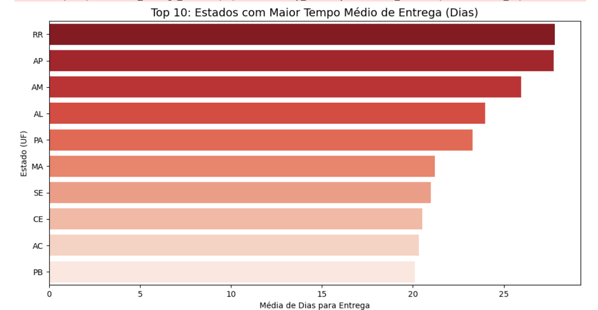
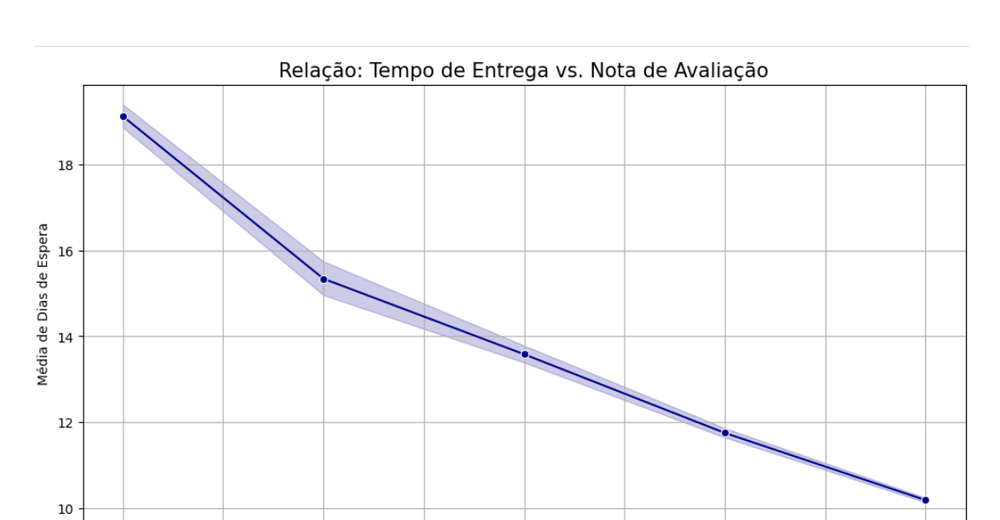
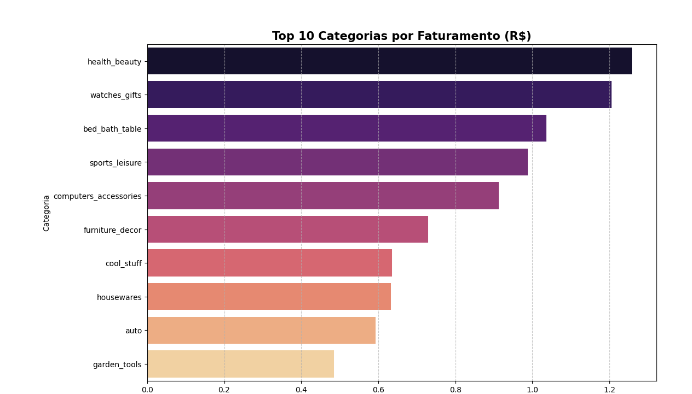

# analise-ecommerce-olist
Projeto de Análise de Dados com Python e Pandas sobre o ecossistema de E-commerce no Brasil.
# Análise Exploratória de Dados: E-Commerce Brasileiro (Olist) 🇧🇷

Este projeto faz parte dos meus estudos em Ciência de Dados, utilizando o dataset público da **Olist** (maior marketplace do Brasil) disponível no Kaggle. O objetivo foi transformar dados brutos de 100 mil pedidos em insights estratégicos de negócio.

## 🛠️ Tecnologias Utilizadas
* **Python 3.12**
* **Pandas**: Manipulação e limpeza de dados.
* **Seaborn & Matplotlib**: Visualização de dados.
* **Kaggle Notebooks**: Ambiente de desenvolvimento.

## 🔍 Principais Insights Obtidos

### 1. Logística e Tempo de Entrega (Lead Time)
Identifiquei que estados como **RR (Roraima)** e **AP (Amapá)** possuem o maior tempo médio de espera, evidenciando os desafios logísticos da região Norte. Em contrapartida, **SP** apresenta a maior eficiência devido à proximidade com os centros de distribuição.

### 2. Satisfação vs. Prazo
Através de uma análise de correlação, ficou provado que o tempo de entrega é o principal fator de detração da nota do cliente. Pedidos com nota 1 (estrela) apresentam um tempo de espera significativamente superior aos de nota 5.

### 3. Sazonalidade e Black Friday
A análise temporal revelou um pico histórico de faturamento em **novembro de 2017**, confirmando o impacto massivo da Black Friday na operação do marketplace.

### 4. Mix de Produtos (Top 10 Categorias)
As categorias de **Beleza & Saúde** e **Relógios & Presentes** lideram o faturamento, mostrando a força desses segmentos no e-commerce brasileiro.

## 📈 Conclusões Técnicas
Durante o projeto, apliquei técnicas de:
* **Data Merging**: União de 5+ tabelas relacionais (pedidos, itens, clientes, produtos e traduções).
* **Feature Engineering**: Conversão de strings para Datetime e criação de colunas de período mensal.
* **Data Cleaning**: Tratamento de valores nulos em datas de entrega.

---
*Projeto desenvolvido por **Ednei** como parte do aprimoramento em Análise de Dados.*

### 1. Logística e Tempo de Entrega (Lead Time)

### 2. Satisfação vs. Prazo

### 3. Sazonalidade e Black Friday

### 4. Mix de Produtos (Top 10 Categorias)

